# Lab7Web

- Nama : Roufan Awaluna Romadhon
- NIM : 31240423
- Kelas : TI.24.A.3

---

## Deskripsi

Tugas ini untuk mempelajari php dan XAMPP

## Langkah-langkah

### Persiapan

Untuk memulai membuat kode php, perlu disiapkan web server dan interpreter PHP terlebih dahulu. Web servar yang kita gunakan adalah Apache 2 dan interpreter PHP 7. Untuk memudahkan proses praktikum, kita gunakan aplikasi bundle web server yaitu
XAMPP.

### Instal XAMPP

Unduh XAMPP dari https://www.apachefriends.org/download.html dan pilih versi portable untuk memudahkan proses installasi. Kemudian extract file tersebut, seusikan direktorinya (misal: d:\xampp).

### Konfigurasi Web Server

- Konfigurasi Apache

Untuk konfigurasi HTTP server, seperti port yang digunakan akses HTTP, modul yang diaktifkan, lokasi document root, dll. Lokasi file: \xampp\apache\conf\httpd.conf

- Konfigurasi PHP

Untuk konfigurasi perilaku engine PHP yang berefek pada keamanan dan performa. Seperti batas maksimal waktu eksekusi script, batas file yang dapat diupload, error reporting, dll.

- Konfigurasi MySql

Konfigurasi server MySQL, seperti administrator user, port, timezone, dll.
Lokasi file: \xampp\mysql\bin\my.ini

### Menjalankan Web Server

Untuk menjalankan web server dari menu XAMPP Control.

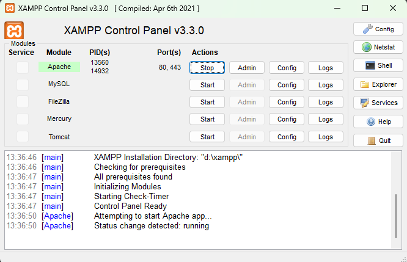

- Uji coba apakah server sudah berkerja dengan baik 

http://127.0.0.1 atau http://localhost
Tampil halaman utama XAMPP jika server sudah berkerja dengan baik.

- Dokumen Website

Semua file website tempatkan di direktori: \xampp\htdocs\

- Database MySQL

Direktori: \xampp\mysql\
Manajemen database: http://localhost/phpmyadmin

### Memulai PHP

Buat folder lab7_php_dasar pada root directory web server (d:\xampp\htdocs)

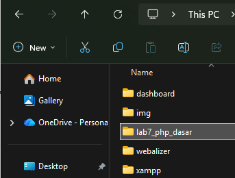

Kemudian untuk mengakses direktory tersebut pada web server dengan mengakses URL:

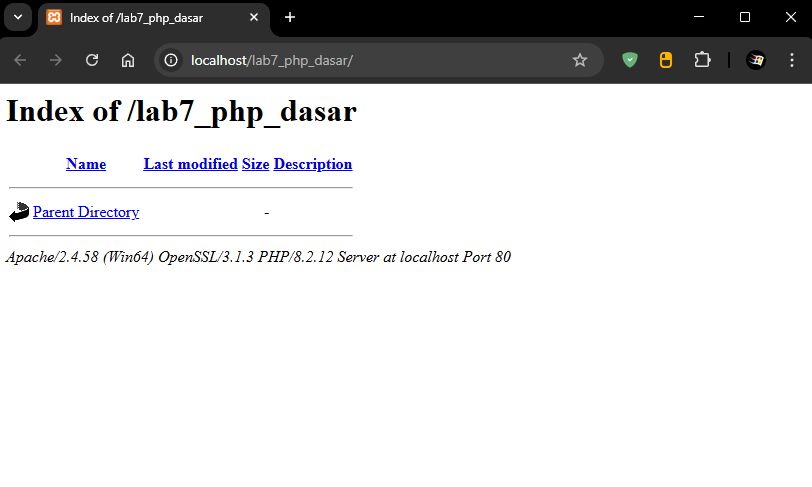

### PHP Dasar

Buat file baru dengan nama php_dasar.php pada directory tersebut. Kemudian buat kode seperti berikut.

```php
<!DOCTYPE html>
<html lang="en">
<head>
    <meta charset="UTF-8">
    <title>PHP Dasar</title>
</head>
<body>
    <h1>Belajar PHP Dasar</h1>
    <?php
        echo "Hello World";
    ?>
</body>
</html>
```

Kemudian untuk mengakses hasilnya melalui URL:
http://localhost/lab7_php_dasar/php_dasar.php

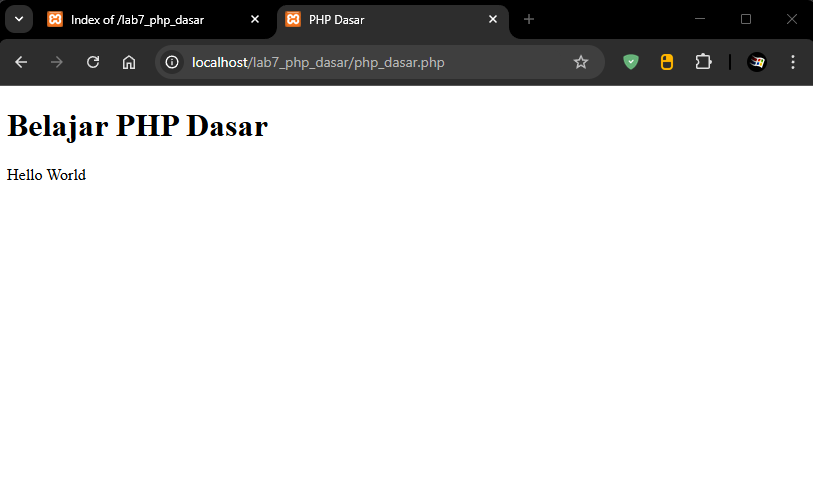

### Variable PHP

Menambahkan variable pada program.

```php
<?php
$nim = "312410423";
$nama = 'Roufan';
echo "NIM : " . $nim . "<br>";
echo "Nama : $nama";
?>
```

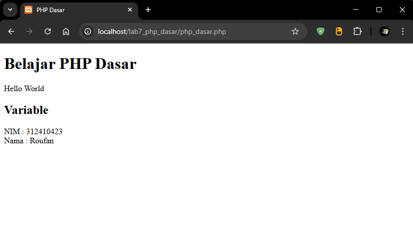

### Predefine Variable $_GET

```php
<?php
echo 'Selamat Datang ' . $_GET['nama'];
?>
```

Untuk mengaksesnya gunakan URL:
http://localhost/lab7_php_dasar/latihan2.php?nama=Roufan

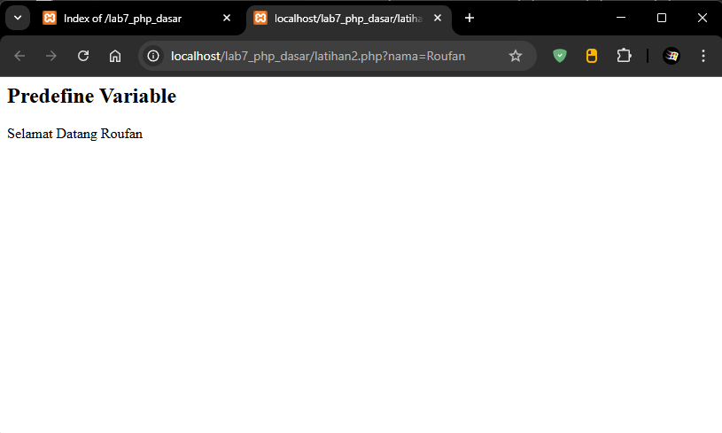

### Membuat Form Input

```php
<!DOCTYPE html>
<html lang="en">
<head>
    <meta charset="UTF-8">
    <title>PHP Dasar</title>
</head>
<body>
<h2>Form Input</h2>
<form method="post">
    <label>Nama: </label>
    <input type="text" name="nama">
    <input type="submit" value="Kirim">
</form>
<?php
echo 'Selamat Datang ' . $_POST['nama'];
?>
</body>
</html>
```

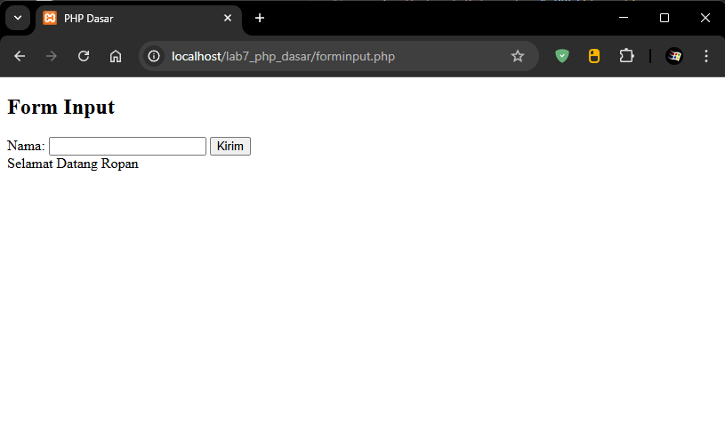

### Operator

```php
<?php
$gaji = 5000000;
$pajak = 0.2;
$thp = $gaji - ($gaji*$pajak);
echo "Gaji sebelum pajak = Rp. $gaji <br>";
echo "Gaji yang dibawa pulang = Rp. $thp";
?>
```

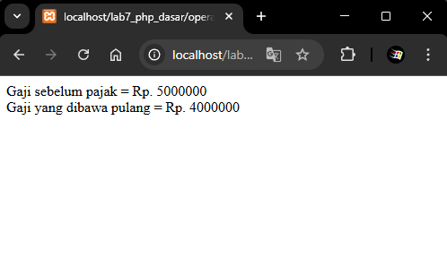

### Kondisi IF

```php
<?php
$nama_hari = date("l");
if ($nama_hari == "Sunday") {
    echo "Minggu";
} elseif ($nama_hari == "Monday") {
    echo "Senin";
} else {
    echo "Selasa";
}
?>
```

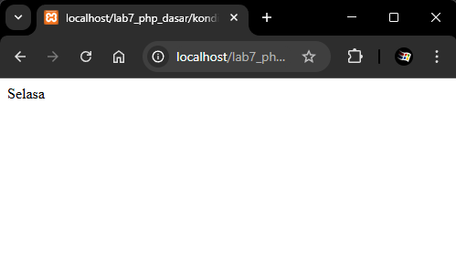

### Kondisi Switch

```php
<?php
$nama_hari = date("l");
switch ($nama_hari) {
    case "Sunday":
        echo "Minggu";
        break;
    case "Monday":
        echo "Senin";
        break;
    case "Tuesday":
        echo "Selasa";
        break;
    default:
        echo "Sabtu";
    }
?>
```

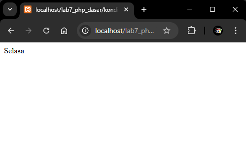

### Perulangan for

```php
<?php
echo "Perulangan 1 sampai 10 <br />";
for ($i=1; $i<=10; $i++) {
    echo "Perulangan ke: " . $i . '<br />';
}

echo "Perulangan Menurun dari 10 ke 1 <br />";
for ($i=10; $i>=1; $i--) {
    echo "Perulangan ke: " . $i . '<br />';
}
?>
```

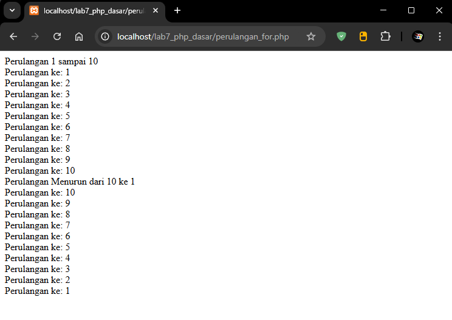

### Perulangan while

```php
<?php
echo "Perulangan 1 sampai 10 <br />";
$i=1;
while ($i<=10) {
    echo "Perulangan ke: " . $i . '<br />';
    $i++;
}
?>
```


### Perulangan dowhile

```php
<?php
echo "Perulangan 1 sampai 10 <br />";
$i=1;
do {
    echo "Perulangan ke: " . $i . '<br />';
    $i++;
} while ($i<=10);
?>
```

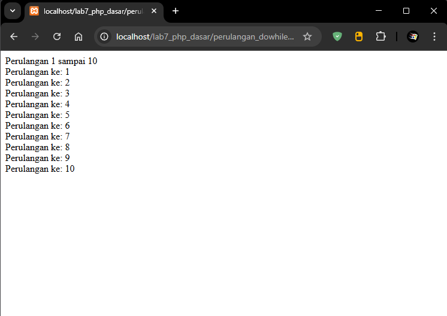

## Pertanyaan dan Tugas

Buatlah program PHP sederhana dengan menggunakan form input yang menampilkan nama, tanggal lahir dan pekerjaan. Kemudian tampilkan outputnya dengan menghitung umur berdasarkan inputan tanggal lahir. Dan pilihan pekerjaan dengan gaji yang berbeda-beda sesuai pilihan pekerjaan.

### Jawab

Berikut adalah kode PHP yang disesuaikan dengan tugas tersebut

```php
<!DOCTYPE html>
<html>
<head>
    <title>Form Data Diri dan Pekerjaan</title>
</head>
<body>

<h2>Form Data Diri</h2>

<form method="POST" action="">
    Nama:<br>
    <input type="text" name="nama" required><br><br>

    Tanggal Lahir:<br>
    <input type="date" name="tanggal_lahir" required><br><br>

    Pekerjaan:<br>
    <select name="pekerjaan" required>
        <option value="">-- Pilih Pekerjaan --</option>
        <option value="Programmer">Programmer</option>
        <option value="Montir">Montir</option>
        <option value="Guru">Guru</option>
        <option value="Dokter">Dokter</option>
        <option value="Pegawai">Pegawai Kantoran</option>
    </select><br><br>

    <input type="submit" name="submit" value="Tampilkan Data">
</form>

<?php
if (isset($_POST['submit'])) {
    $nama = $_POST['nama'];
    $tanggal_lahir = $_POST['tanggal_lahir'];
    $pekerjaan = $_POST['pekerjaan'];

    $lahir = new DateTime($tanggal_lahir);
    $sekarang = new DateTime();
    $umur = $sekarang->diff($lahir)->y;

    switch ($pekerjaan) {
        case "Programmer":
            $gaji = 10000000;
            break;
        case "Montir":
            $gaji = 8000000;
            break;
        case "Guru":
            $gaji = 6000000;
            break;
        case "Dokter":
            $gaji = 15000000;
            break;
        case "Pegawai":
            $gaji = 7000000;
            break;
        default:
            $gaji = 0;
    }

    echo "<hr>";
    echo "<h3>Hasil Data Diri</h3>";
    echo "Nama: $nama <br>";
    echo "Tanggal Lahir: $tanggal_lahir <br>";
    echo "Umur: $umur tahun <br>";
    echo "Pekerjaan: $pekerjaan <br>";
    echo "Gaji: Rp " . number_format($gaji, 0, ',', '.') . "<br>";
}
?>

</body>
</html>
```

### Demo (gif)

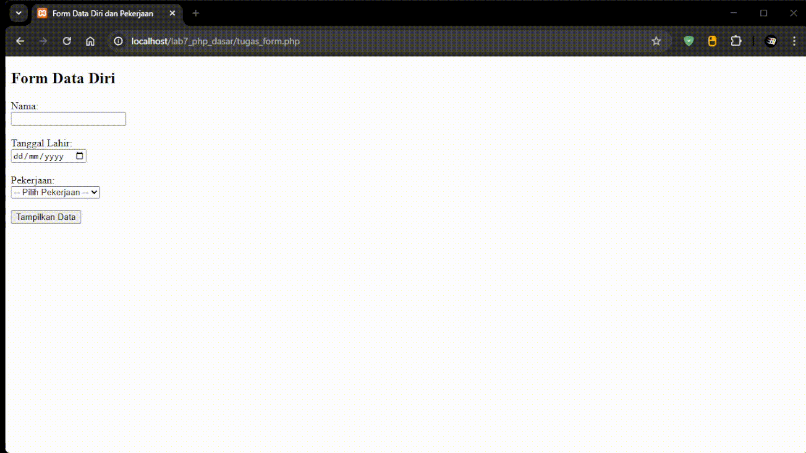